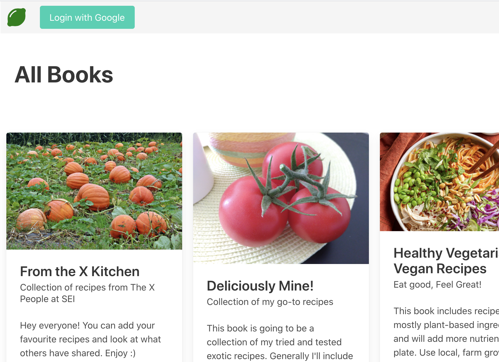
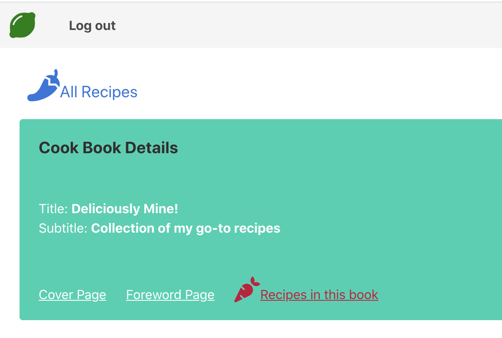
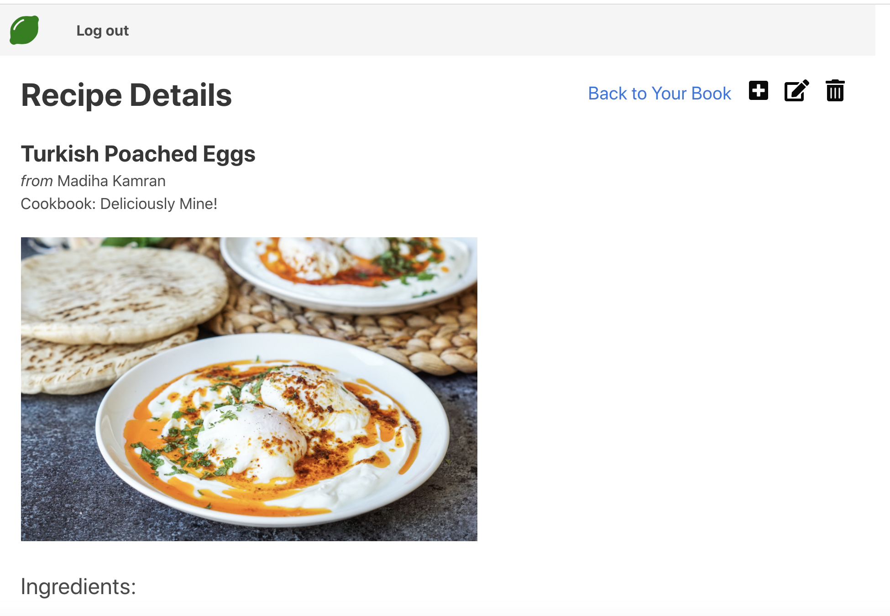
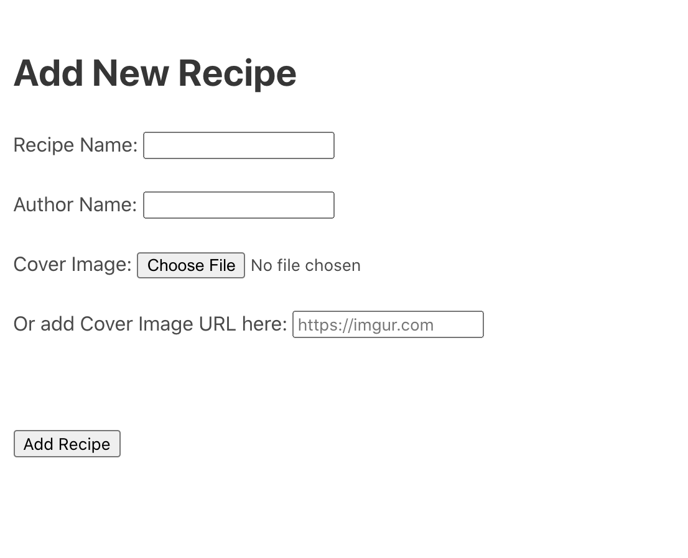

# cookbooks

 
 

The idea of this project stemmed from my hobby of cooking exotic recipes. I try new recipes, practice them a few times but generally don't write them and then learn and practice some other recipe.   It feels great if I can add all the recipes in one place along with a photo, more like a digital cookbook.  This project also implements google oauth as authentication procedure.

## Screenshots:

 

 

 

 
## Technologies Used:

Nodejs, Express, Google oauth, Bulma, HTML , CSS, JavaScript, Flexbox, JSON API, pdfmake, imgurAPI, fontawesome icons

## Getting Started:

### Link: https://cookbook-express-app.herokuapp.com/cookbooks

### Instructions:

This app offers 2 options:

<ul>
	<li>Logged in user can create new books and recipes and update his own recipes too.</li>
	<li>Not logged in user can only view cookbooks and recipes by other users.</li>
</ul>
 

## Planned Future Enhancements:

Following are some enhancements in line:

<ul>
  <li> Improve CSS layout of home page</li>
  <li>Rework the recipe page in order to make it better UI for adding ingredients an dtheir quantities</li>
  <li>work with pdfmake to publish book recipes as pdf.</li>
</ul>
